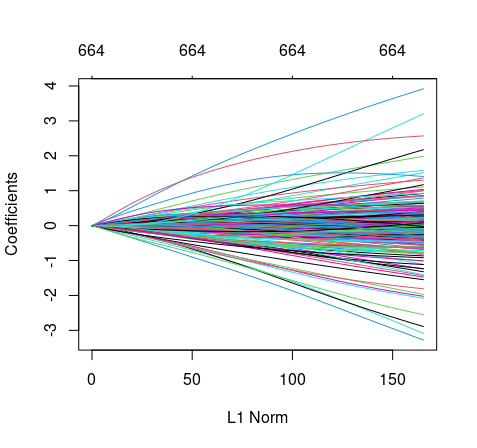

```{r setup, include=FALSE}
knitr::opts_chunk$set(echo = TRUE, eval = FALSE)
```

```{r packages, include=FALSE, echo=FALSE}
library(tidyverse)
library(ggtext)
#library(lubridate)
#library(glue)
#library(ggpubr)
#library(rstatix)
library(caret)
library(randomForest)
library(e1071)
library(glmnet)
library(keras)
library(tensorflow)
require(reticulate)
```


# Chargement et préparation de données réelles  

Nous nommerons le jeu de données de cancer du sein METABRIC téléchargé depuis [kaggle](https://www.kaggle.com/raghadalharbi/breast-cancer-gene-expression-profiles-metabric) par *datacancer* dans ce projet. 

 
## Chargement, description et préparation du jeu de données: 


```{r data, include=FALSE}

datacancer <- read.csv("data/METABRIC_RNA_Mutation.csv") 
head(datacancer, 10)
  
```
Le jeu de données compte 1904 obervations et 693 variables.

On voit que les patientes décédées du cancer ou non  sont codés dans une variable catégorielle   _death_from_cancer_ à 3 niveaux: 

 - _Living_: si la patiente est en vie,
 - _Died of Disease_: si la patiente est morte du cancer du sein,
 - _Died of Other Causes_: si la patiente est morte d'une cause différente du cancer du sein 

Pour chaque patiente, on attribue un identifiant unique _patient_id_.  On donne l'âge  de la patiente au moment où elle a été diagnostiquée porteuse du cancer ( _age_at_dignosis_ ), si ellle suit une chimiothérapie ou pas ( _chemotherapy_ ), le diagnostic du nombre de mutation du cancer ( _mutation_count_ ), la taille de la tumeur ( _tumor_size_ ) et son état de développement ( _tumor_stage_ ).


Nous allons coder la variable _death from cancer_ en bianaire où le niveau _Died of Disease_=1 et 0 pour les autres en:
 
 a. créant  une variable Y binaire qui vaut 1 pour les patientes décédées du cancer et 0 pour les autres,
 b. ne gardant que les variables   _age_at_dignosis_, _tumor_size_, _mutation_count_, _death_from_cancer_  et celles allant de la colonne 32 à 693,
 
 
```{r recodage1}
 datacancer <- datacancer %>% 
   select( age_at_diagnosis, tumor_size, mutation_count, Y=death_from_cancer, all_of(32:693)) %>%  # ici Y=death_from_cancer pour renommer la variable death_from_cancer par Y
   mutate( Y= if_else(Y=="Died of Disease",1,0) ) # pour le recodage en binaire
```

Le jeu de données compte maintenant 1904 observations et 666 colonnes. 
 
  c. modifiant les données de mutations en variables binaires: 1 pour chaque mutation, quelque soit le code qui la décrive.
   
   Les données de mutations se terminent par _\_mut_. Elles vont de la colonne 494 à la fin du tableau. 
   
```{r recodage2, include=TRUE,eval=FALSE}
datacancer[494:666] <- if_else(datacancer[494:666]==0,0,1) # si pas mutation: 0 sinon 1 

datacancer %>% 
  filter(is.na(mutation_count) | is.na(tumor_size))# 65 données manquantes pour l'ensemble mutation_count et tumor_size
 
datacancer <- datacancer %>% 
  drop_na(tumor_size,mutation_count)
any(is.na(datacancer)) # pour vérifier qu'il ne reste rien de données manquantes

```


  
   
Le jeu de données _datacancer_ est en fin préparée pour les parties 2 et 3. J'ai préféré supprimer les données manquantes puisqu'il n'y a qu'en tout 65 au total.

# Prédiction 

## Choisir trois méthodes de prédiction vues en cours 

- Méthodes de prédiction avec forêt aléatoire:

  Tout d'abord un arbre de décision est un organigramme   qui permet de classifier des données d'entrées ou de prédire la valeur de sortie de ces   données.   Il est facile à interprété et à visualiser et est péfèré des méthodes à noyau [@Chollet2022]. En particulier, les forêts aléatoires sont robustes et pratiques en apprentissage et impliquent plusieurs arbres de décision et assemblent leurs sorties [@Chollet2022]. Ils permettent aussi de diminuer le risque de sur-apprentissage.

- Méthode de prédiction SVM:

  Elle est simple à utiliser car nécessitant peu de paramètres. SVM est un algorithme de classification qui fonctionne en trouvant des «frontières de décision» séparant deux classes. 
  
- Méthode de prédiction avec pénalité: 

  La régression pénalisée permet de gérer les corrélations entre covariables ou encore la sélection des variables. Deux types de pénalités: Lasso pour la sélection de variable et Ridge pour la corrélation entre variables. La pénalité  Elastic-net  est un bon compromis entre les deux autres types de pénalités.


 a. aucune réduction de dimension

   1. Méthodes de prédiction avec forêt aléatoire 
     
      - Séparation du jeu d'apprentissage et mise en facteur la variable Y 

```{r train1, }
# On met la variable Y en facteur labellisée en (0="no" for Others cases) et ( 1="yes" for Death from Cancer)
datacancer <- datacancer %>% 
  mutate(Y=as.factor(if_else(Y==0,"no","yes") ) )

#  Séparation du jeu de données en jeu de test et d'apprentissage
inTrain <- createDataPartition(
  y <- datacancer$Y,
  p=.75,
  list = FALSE
)

# jeu d'apprentissage
cancerTraining <- datacancer %>% 
  slice(n=inTrain)
# jeu de test
cancerTest <- datacancer %>% 
  slice(n=-inTrain)

# crtl est un paramètre de contrôle avec validation croisée qu'on utilisera dans train
ctrl <- trainControl(
  #method = "boot",
  method="repeatedcv",
  number=10,
  repeats = 3,
  classProbs = TRUE, 
  summaryFunction = twoClassSummary
)

# Ajustement  
rfFit <- train(
  Y ~.,
  data = cancerTraining,
  method = "rf",
  tuneLength = 13,
  trControl = ctrl,
  metric = "ROC"
)


```
  
  
```{r ROC, fig.cap=" Courbe ROC avec validation croisée", fig.align='center', echo=TRUE, eval=TRUE}
knitr::include_graphics("pictures/ROC_cross_validation.png", auto_pdf = T)

```
  
     
Le modèle ayant la meilleure prédiction par validation croisée est alors le modèle final en sortie. On regardera ensuite les performances de l'arbre apris sur le jeu test

```{r finalModel}
decision <- rfFit$finalModel

#  Prédiction du modèle
prediction <- predict(decision,cancerTest)
# la matrice de confusion
confMat <- confusionMatrix(prediction,cancerTest$Y)
save(confMat, file = "data/confMat.RData")

```
```{r}
load("data/confMat.RData")
confMat
```

l'Accuracy indique la proportion de bien classé (le pourcentage de nombres d'individus bien classés sur le jeu text). Il indique 70\%.
la sensitivité qui indique la proportion de vraies décédées du cancer est de 96\%. On a 7\% qui sont survécues ou qont mortes d'une autre façon différente non causée par le cancer du sein. 

  
  2. Méthode de prédiction SVM 
      
     - Sur le jeu d'apprentissage créé précédemment, on apllique les deux méthodes de SVM: linéaire et à noyaux.
      
```{r svm0}
linearsvm <-  svm(formula = Y~., 
                  data = cancerTraining,
                  type = 'C-classification', 
                  kernel = 'linear'
                  )


gaussiansvm <- svm(formula = Y~., 
                   data = cancerTraining,
                   type = 'C-classification', 
                   kernel = 'radial'
                   )

```
   
   - Prédiction sur le jeu test
   
```{r svm1}
linearpred   <- predict(linearsvm, newdata = cancerTest)
gaussianpred <- predict(gaussiansvm, newdata = cancerTest)

confMatSVM_lin <- confusionMatrix(data=linearpred,cancerTest$Y)
confMatSVM_gau <- confusionMatrix(data=gaussianpred,cancerTest$Y)
save(confMatSVM_lin,file="data/confMatSVM_lin.RData")
save(confMatSVM_gau,file="data/confMatSVM_gau.RData")
```
      
```{r confmat, eval=TRUE}
load(file="data/confMatSVM_lin.RData")
load(file="data/confMatSVM_gau.RData")
print(confMatSVM_lin)
print(confMatSVM_gau)

```


     
   3. Méthode de prédiction avec pénalité
    
     Nous disposons de trois méthodes pour la régression pénalisée: Lasso, Ridge et  Elastic-net. Soient le jeu d'apprentissage _cancerTraining_ et le jeu test _cancerTest_ crées précédemment.
    
```{r train_penality_learning}
#jeu d'apprentissage 
y.train <- cancerTraining %>% 
  select(Y) %>%
  as.matrix()
y.test <- cancerTest %>% 
  select(Y) %>% 
  as.matrix()

x.train <- cancerTraining %>% 
  select(-Y) %>% 
  as.matrix()

x.test <- cancerTest %>% 
  select(-Y) %>% 
  as.matrix()

```
 
   - Pénalité Ridge
     
```{r ridge, eval=F}
model.ridge <- glmnet(x.train,y.train,family = "binomial",alpha=0)
plot(model.ridge)
```


```{r fig_ridge, fig.align='center', fig.cap=" Modèle ridge", eval=TRUE}


```


\newpage      
  - Lasso 
   
```{r lasso, fig.align='center',fig.cap=""}
model.lasso <- glmnet(x.train,y.train,family = "binomial",alpha=1)
```

```{r fig_lasso, fig.align='center', fig.cap=" Modèle Lasso",eval=TRUE}
knitr::include_graphics("pictures/lasso.png")

```

 
 
 
 
 
  
  - Elastic net
   
```{r elastic_net}
model.elastic_net <- glmnet(x.train,y.train,family = "binomial",alpha=.5)

```

```{r fig_EN, fig.align='center', fig.cap=" Modèle Elastic net", eval=TRUE}


```

Nous choisirons la méthode _elastic net_ en  procédant par validation croisée. Car c'est un bon compromis entre les deux.
 
 
```{r elastic_net1}
cancer.cv <- cv.glmnet(x.train,y.train,nfolds=20,family="binomial")
cancer.cv$lambda.min
model.EN.cv <- glmnet(x.train,y.train,family="binomial",alpha=0.5,nlambda=1,lambda=cancer.cv$lambda.min)

```
 
 
   - Prédiction du modèle sur le jeu test
  
```{r}
cancerpredict.EN.cv <- predict(model.EN.cv,x.train,type="response",family="binomial")
results <- tibble(proba=cancerpredict.EN.cv,y.pred=round(cancerpredict.EN.cv),y.truth=(y.train=="yes")*1)
results
cfMat.EN <- confusionMatrix(data = as_factor(results$y.pred),as_factor(results$y.truth))
save(cfMat.EN,file = "pictures/cfMat_acp.RData")
```


```{r cfMat_svm}
load(file = "pictures/cfMat_acp.RData")
cfMat.EN
```
La matrice de confusion donne un bon taux de classement (78\%) sur le jeu test avec une bonne sensitivité  de 93\% et une spécificité assez faible de 47.4%.
  
  
  
 b. par ACP 
   
   - Réduction de dimension par ACP
    
    
```{r acp}
acp <- datacancer %>% 
  select(-Y) %>% as.matrix() %>% 
  prcomp()

# selection des variables avec 70% 
nvar <- which(cumsum(acp[["sdev"]])/sum(acp[["sdev"]])>.7)

cancerTraining_ACP <- as_tibble(acp$x[,1:nvar]) %>% 
                   mutate(Y=datacancer$Y,
                   .before="PC1"
                     ) %>% 
                   slice(n=inTrain)

cancerTest_ACP <- as_tibble(acp$x[,1:nvar]) %>% 
                   mutate(Y=datacancer$Y,
                   .before="PC1"
                     ) %>% 
                   slice(n=-inTrain)

  
```


On a une diminution de nombre de variable de 244.

  
   1. Méthodes de prédiction avec forêt aléatoire 
   
```{r train_acp}
rfFit_ACP <- train(
  Y ~ .,
  data = cancerTraining_ACP,
  method = "rf",
  tuneLength = 13, #donne le nombre de valeurs à essayer pour chaque paramètre à faire varier (ici nombre de variables à prendre en compte)
  trControl = ctrl,
  metric = "ROC"
)
plot(rfit)
```

```{r roc_acp, fig.align='center', fig.cap="Courbe ROC par validation croisée/Avec réduction de dimension",eval=TRUE}
knitr::include_graphics("pictures/ROC_cross_validation_acp.png", auto_pdf = TRUE)
```
  
  
```{r prediction_acp, include=FALSE}
prediction_acp <- predict(rfFit_ACP,cancerTest_ACP)

confMat_ACP <- confusionMatrix(prediction_acp,cancerTest_ACP$Y) 
save(confMat_ACP, file = "data/confMat_ACP.RData")
```

```{r pred_acp, eval=TRUE}
load("data/confMat_ACP.RData")
confMat_ACP
```

66% des individus sont bien classés selon cette méthode avec un bon taux du nombre de patientes décédées (97%). Cependant la spécifité est très faible (4%)


  
  2. Méthode de prédiction SVM 
  
   - On réutilise les jeux d'apprentissage et de test précédemment dans cette dsection ( _cancderTraining_ACP_ et _canccerTest_ACP_ ).
    
```{r}
linearsvm_acp <-  svm(formula = Y~., 
                  data = cancerTraining_ACP,
                  type = 'C-classification', 
                  kernel = 'linear')

gaussiansvm_acp <- svm(formula = Y~., 
                   data = cancerTraining_ACP,
                   type = 'C-classification', 
                   kernel = 'radial')
```
 
   
   - Prédiction sur le jeu  test et matrice de confusion
   
```{r}
linearpred_acp      <- predict(linearsvm_acp, newdata = cancerTest_ACP)
gaussianpred_acp    <- predict(gaussiansvm_acp, newdata = cancerTest_ACP)
confMat_svm_acp_lin <- confusionMatrix(data=linearpred_acp,cancerTest_ACP$Y)
confMat_svm_acp_gau <- confusionMatrix(data=gaussianpred_acp,cancerTest_ACP$Y)

save(confMat_svm_acp_lin, file = "data/confMat_svm_acp_lin.RData")
save(confMat_svm_acp_gau,file = "data/confMat_svm_acp_gau.RData")
```
   


```{r svm_acp, eval=TRUE}
load("data/confMat_svm_acp_lin.RData")
load("data/confMat_svm_acp_gau.RData")

confMat_svm_acp_lin
confMat_svm_acp_gau

```

     
  3. Méthode de prédiction avec pénalité
  
```{r train_penality_learning_acp}
#jeu d'apprentissage 
y.train_acp <- cancerTraining_ACP %>% 
  select(Y) %>%
  as.matrix()

x.train_acp <- cancerTraining_ACP %>% 
  select(-Y) %>% 
  as.matrix()

```

  - Pénalité Ridge

```{r}
model.ridge_acp <- glmnet(x.train_acp,y.train_acp,family = "binomial" ,alpha=0)
plot(model.ridge_acp)
```

```{r ridge_acp, fig.cap="Méthde de Ridge",fig.align='center',eval=TRUE, out.width="40%"}
knitr::include_graphics("pictures/ridge_acp.png", auto_pdf = TRUE)
```

  - Pénalité Lasso
  
```{r}
model.lasso_acp <- glmnet(x.train_acp,y.train_acp,family = "binomial" , alpha=1)
plot(model.lasso_acp)
```

```{r lasso_acp, fig.cap="Pénalité Lasso",fig.align='center', eval=TRUE,out.width="40%"}
knitr::include_graphics("pictures/lasso_acp.png", auto_pdf = TRUE)

```


  - Pénalité Elastic net
 
 
```{r}
model.elastic_net_acp <- glmnet(x.train_acp,y.train_acp,family = "binomial" , alpha=.5)
plot(model.elastic_net_acp)
```

```{r elastic_net_acp, fig.cap="Elastic net",fig.align='center', eval=TRUE,out.width="40%"}
knitr::include_graphics("pictures/elastic_net_acp.png", auto_pdf = TRUE)

```

  - Prédition avec elastic net


```{r}
cancer.cv_acp <- cv.glmnet(x.train_acp,y.train_acp,nfolds=10,family="binomial" )
cancer.cv_acp$lambda.min
model.EN.cv_acp <- glmnet(x.train_acp,y.train_acp,family="binomial" ,alpha=0.5,nlambda=100,lambda=cancer.cv_acp$lambda.min)

cancerpredict.EN.cv_acp <- predict(model.EN.cv_acp,x.train_acp,type="response", family="binomial" )
results_acp <- tibble(proba=cancerpredict.EN.cv_acp,pred=round(cancerpredict.EN.cv_acp),y.truth=(y.train_acp=="yes") *1 )
results_acp
confMat_EN_acp <- confusionMatrix(data=as_factor(results_acp$pred),as_factor(results_acp$y.truth))
save(confMat_EN_acp,file = "data/confMat_EN_acp.RData")

```

- Matrice de confusion

```{r}
load(file = "data/confMat_EN_acp.RData")
confMat_EN_acp

```

On a 74% d'individus bien classés mais avec un mauvais taux de vrai négatif (seulement 31,4% des individus non décédées du cancer sont détectés). Par contre on a une sensitivité de 95%.

\newpage
c. par auto-encodeur 

Nous utiliserons le package _keras_ et/ou _tensorflow_ pour cette partie auto-encodeur et considérons le jeu d'apprentissage _cancerTraining_


  - Préparation des données
```{r toy_data}

y <-  cancerTraining %>% 
  mutate(Y=if_else(Y=="no",0,1)) %>% 
  select(Y)  %>% 
  as.matrix()
y <- to_categorical(y)

y.test <-  cancerTest %>% 
  mutate(Y=if_else(Y=="no",0,1)) %>% 
  select(Y) %>% 
  as.matrix()
y.test <- to_categorical(y.test)


x <- cancerTraining %>% 
  select(-Y) %>% 
  as.matrix()
x <- array_reshape(x,dim(x))

x.test <- cancerTest %>% 
  select(-Y) %>% 
  as.matrix()
x.test <- array_reshape(x.test,dim(x.test))


```

 - Apprentissage

```{r learning_toy_data}
model <- keras_model_sequential( input_shape = c(665))
model %>% 
  layer_dense(units = 64, activation = "relu") %>% 
  layer_dense(units = 32, activation = "sigmoid") %>% 
  layer_dense(units = 2, activation = "softmax")  

model

model$weights


# compile
model %>% compile(
#loss = 'binary_crossentropy',
loss = 'mean_squared_error',
optimizer = 'adam',
metrics = c('accuracy')
)

# Validation

# Nous utilisons l'argument validation_data pour apprendre sur le jeu de données test en faisant sortir
# les erreurs quadratiques ansi que la proportion d'individus classée
history <- model %>% fit(
x, y, 
epoch=100,
batch_size = 128,
validation_data=list(x.test,y.test)
#validation_split = 0.2,
#verbose=FALSE
)

str(history$metrics)
str(history$params)

history$metrics$val_accuracy[100]
history$metrics$val_loss[100]

plot(history)
```


```{r keras, fig.align='center', fig.cap=" Erreur moyenne quadratique et prédiction", eval=TRUE,echo=FALSE}

```

Avec keras, on a une précision de 61% sur  100 itération et une erreur quadratique moyenne de 0.302 . 

- Prédicton

```{r}
y.pred  <- model %>%
  predict(x.test, type = "response") %>% 
  apply(1,which.max)-1

y.test_test <- y.test %>% 
    apply(1,which.max)-1


head(predictions, 10)


datapred <- data.frame(x1=predictions[,1],x2=predictions[,2],y=y.pred)

# Affichage de la ségmentation du plan
# predviz <- datapred %>% 
#   ggplot() +
#   geom_point(mapping=aes(x=x1, y=x2,color=y)) 
# predviz

confusionMatrix(as_factor(y.pred), as_factor(y.test_test))
```

On a une sensitivité de 76% et une spécifité de 32%. 

## Discussion sur leurs avantages et inconvénients


- forêt aléatoire

  + Avantages: permet d'éviter le surapprentissage, paramètre facile à déterminer.
  + Inconvénients: computentionnellement lourd à réaliser quand le nombre d'arbres est grand

- Méthode SVM

  - Avantages: précision sur la prédiction, fonctionne bien sur de petits jeux de données
  - Inconvénients: ne convient pas aux jeux de données trop volumineux, Difficulté d’interprétations

- Régression pénalisée

  - Avantages: en utilisant elastic-net permet de conserver les avantages de Lasso et de Ridge 
  - Inconvénients: il y a un nouveau paramètres à définir par cross-validation


Comme nous avons un jeu de données volumineux (1839x666), la réduction de dimension a été utile, réduisant le nombre de variables à 244. 

# Sélection  


Proposons une manière d'effectuer une selection à l'aide d'une selection par stabilité et mettrons la en oeuvre.
On lance *B* bootstraps et on apprend sur chacun d'eux un modèle de pénalité Elastic net (\(\alpha=0.5\)) sans aucune réduction de dimension et on garde les ARN/mutaions les plus souvent selectionnés.


```{r selection}
# on réactualise le jeu d'apprentissage x.train en haut partie 'aucune réduction de dimension' 
B=2000 # nombre de bootstraps
ncandidats <- dim(x.train)[1]
selected <- rep(0,dim(x.train)[2]) 
for (b in 1:B){
  #echantillon bootstrap
  bootsample <- sample(1:ncandidats,ncandidats,replace=TRUE)
  x.boot <- x.train[bootsample,]
  y.boot <- y.train[bootsample,]
  #apprentissage
  model.boot <- glmnet(x.boot,y.boot,family="binomial",alpha=0.5,nlambda=1,lambda=.5*cancer.cv$lambda.min)
  selectedmutations <- model.boot$beta@i
  for (i in selectedmutations){
    selected[i] <- selected[i] +1
  }
}
```


```{r }
#restriction du jeu d'apprentissage aux mutations étant sélectionnés au moins 1/2 du temps
selection <- which(selected>B/2)

x.train.stab <- data.frame(x.train[,selection]) %>% 
  select(ends_with('_mut')) # selection des 130 mutations sur les 173 de départ
  
cancerTrain.stab <- data.frame(Y=y.train,x.train[,selection]) %>% 
  as_tibble() %>% 
  mutate(Y=if_else(Y=="no",0,1))

x.test <- data.frame(x.test) %>% 
  as_tibble()


# apprentissage suivant un modèle linéaire classique
model <- glm(Y~.,cancerTrain.stab,family = binomial(link = "logit"))

predictions <- predict(model,newdata = x.test,type="response")

confMat_selection <- confusionMatrix(data=as_factor(round(predictions)),as_factor((y.test=="yes")*1))
save(confMat_selection, file="data/confMat_selection.RData")

```


```{r echo=FALSE, eval=TRUE}
load("data/confMat_selection.RData")
confMat_selection
```


On retrouve 130 variables des mutations et expressions de gènes  sélectionnées la plus part du temps. Le taux de vrais positifs (décédées) est assez bonne (80%) mais le taux de vrais négatifs est très faible (35.5%) 


# Références


